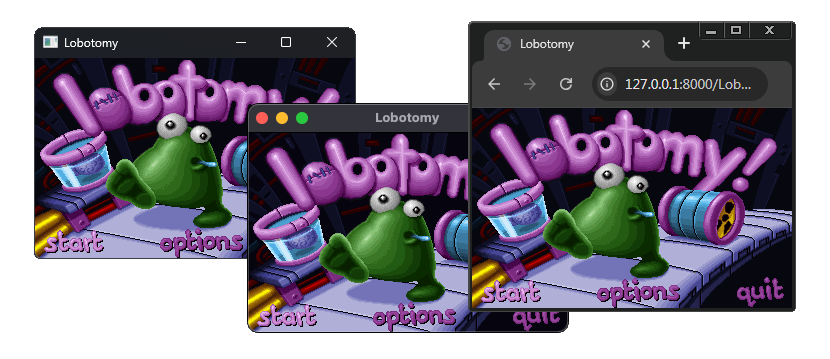

# NuclearRT

NuclearRT is a fast, open-source, cross-platform C++ runtime for Clickteam Fusion 2.5.

    

> [!CAUTION]
> This project is still in development and is not ready for general use.

## Features
- Faster than the default runtime.
- Provides 64-bit support
- Native Linux & macOS support

## Limitations
- Any missing extension will need to be rewritten.
- Sub-Applications are not supported.

## Supported Platforms
- Windows
- Linux
- macOS (Intel & Apple Silicon)
- Web
- Switch (Homebrew)

## Supported Backends
- SDL3
- SDL2

## Requirements
- Clickteam Fusion 2.5 R295.10 or higher
- CMake 3.14 or higher
- A C++ compiler, such as MSVC or GCC
- Web:
  - Emscripten
- Switch:
  - DevkitPro, SDL2 Portlibs

## Usage

Release builds are still not ready. You can build the application manually by following the instructions in the [Development](#development) section.

## Development

Working on NuclearRT has a bit of a strange workflow. The easiest way to do it is:
1. Clone the repository.
2. Create a Symbolic Link for the [exporter](/exporter) from `nuclearrt\exporter\bin\Debug\net9.0-windows` to `Clickteam Fusion 2.5\Data\Runtime\nuclearrt\exporter`
3. Create a Symbolic Link for the base [runtime](/runtime) from `nuclearrt\runtime` to `Clickteam Fusion 2.5\Data\Runtime\nuclearrt\runtime`
4. Build the exporter [plugin](/plugin) and copy the `nuclearrt.bld` file to `Clickteam Fusion 2.5\Data\Runtime\`

If you make any changes to the exporter:
1. `dotnet build` in the `exporter` directory.
2. Build the application in Fusion.

If you make any changes to the base runtime:
1. Build the application in Fusion.

## Contributing

Contributions are welcome! Please open an issue or pull request to contribute.

## License

This project is licensed under the AGPL-3.0 license. See the [LICENSE](LICENSE) file for details.

## Sonic XG / Forever — Web Port

**Sonic XG** (aka *Sonic eXtended Genesis*) e um fangame classico da serie Sonic, criado originalmente em 2002 por **Euan "Sir Euan" Gallacher** e **Joseph "Nitemare" Waters**, com contribuicoes de **Christian "The Taxman" Whitehead** (criador do Retro-Sonic e dev do Sonic Mania).

### Historia do Projeto

- **2002** — Euan Gallacher comeca o projeto chamado **Sonic Forever**, postando blogs e updates no site do projeto.
- **~2005** — O nome muda pra **Sonic XG** (eXtended Genesis). Euan e Joseph Waters comecam a trabalhar juntos.
- **2007** — Christian "The Taxman" Whitehead entra no projeto, e o XG faz merge com o Retro-Sonic pra virar **Retro-Sonic XG**. Mas o Whitehead acaba focando em outros projetos (port do Sonic CD pra iOS, Sonic 1 e 2, etc).
- **2014** — Euan e Joseph lançam uma demo privada em **Multimedia Fusion 2** (MMF2) com Final Fall, Peak Panic e Palm Paradiso.
- **2017** — Joseph Waters lança outra demo em **Clickteam Fusion 2.5**. Esta e a versao que estamos portando pro browser.
- **2021** — Joseph Waters retoma o projeto como projeto solo, usando assets que o Whitehead ainda tinha do Retro-Sonic XG.
- **2024–2025** — A equipe **Ultra Ring** pega o projeto e muda o engine pra **GameMaker Studio 2** com o framework **Harmony** (compilador YYC). A demo se chama **Sonic Forever** como homenagem ao nome original de 2002.

### O que sobrou da equipe?

- **Euan "Sir Euan" Gallacher** — Criador original, ainda envolvido como consultor.
- **Joseph "Nitemare" Waters** — Co-criador, dev principal das versoes 2014 e 2017.
- **Christian "The Taxman" Whitehead** — Trabalhou no Retro-Sonic XG mas foi focar nos ports oficiais da Sega (Sonic CD, 1, 2, Mania). Hoje e o dev do Sonic Mania.
- **Ultra Ring** — Equipe nova cuidando do projeto Forever (2025).

### Este Web Port

Este web port decompila o executavel do Fusion 2.5 (demo de 2017 do Joseph) usando [CTFAK](https://github.com/CTFAK),
exporta os dados do jogo通过 um exporter customizado do NuclearRT, e compila o runtime C++ pra WebAssembly
via Emscripten — fazendo a versao de 2017 rodar em qualquer navegador moderno.

### Credits (Sonic XG Web Port)

- **Euan "Sir Euan" Gallacher** — Criador original do Sonic XG / Forever.
- **Joseph "Nitemare" Waters** — Co-criador e dev da demo de 2017.
- **Christian "The Taxman" Whitehead** — Co-desenvolvedor (Retro-Sonic XG), criador do Sonic Mania.
- **Ultra Ring** — Equipe atual desenvolvendo o Sonic Forever (2025) em GameMaker.
- **NuclearRT** — Runtime C++ cross-platform que torna este port possivel.
- **CTFAK** — Decompiler usado pra extrair os dados do executavel do Fusion 2.5.
- **Emscripten** — Toolchain de compilacao C/C++ pra WebAssembly.
- **Greenzin1** — Porting, pipeline CI/CD, e deploy web.

## Credits

- [Clickteam](https://www.clickteam.com/) for making Fusion.
- [MP2](https://www.mp2.dk/) for making Chowdren and inspiring me to make this runtime and making the Fusion plugin.
- [CTFAK](https://github.com/CTFAK) for making the decompiler used in this project.
